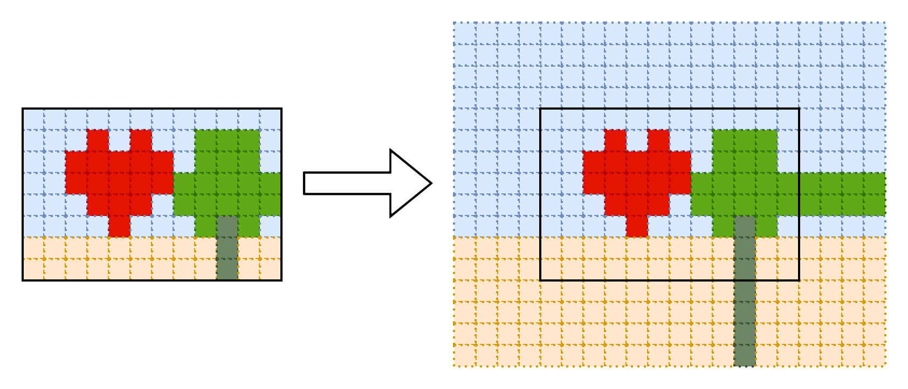
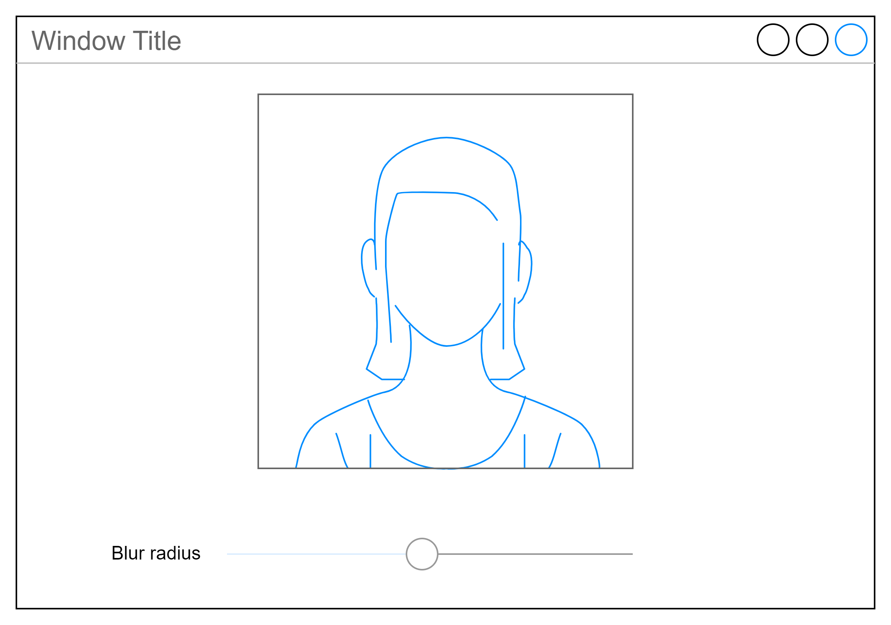

# Лабораторная работа №2 — Параллельная обработка данных с использованием многопоточности

- [Лабораторная работа №2 — Параллельная обработка данных с использованием многопоточности](#лабораторная-работа-2--параллельная-обработка-данных-с-использованием-многопоточности)
  - [Задания](#задания)
    - [Требования](#требования)
    - [Задание №1](#задание-1)
      - [Вариант 1 — 100 баллов](#вариант-1--100-баллов)
        - [Бонус за возможность динамической визуализации игрового состояния — 50 баллов](#бонус-за-возможность-динамической-визуализации-игрового-состояния--50-баллов)
        - [Бонус за анализ производительности — 20 баллов](#бонус-за-анализ-производительности--20-баллов)
    - [Задание №2](#задание-2)
      - [Вариант 1 — Фильтр Гауссова размытия — 100 баллов](#вариант-1--фильтр-гауссова-размытия--100-баллов)
        - [Бонус за наличие GUI-интерфейса — 50 баллов](#бонус-за-наличие-gui-интерфейса--50-баллов)
        - [Бонус за анализ производительности — 20 баллов](#бонус-за-анализ-производительности--20-баллов-1)
      - [Вариант 2 — Медианный фильтр — 80 баллов](#вариант-2--медианный-фильтр--80-баллов)
        - [Бонус за наличие GUI-интерфейса — 50 баллов](#бонус-за-наличие-gui-интерфейса--50-баллов-1)
        - [Бонус за анализ производительности — 20 баллов](#бонус-за-анализ-производительности--20-баллов-2)

## Задания

- Для получения оценки "удовлетворительно" нужно набрать не менее 120 баллов.
- На оценку "хорошо" нужно набрать не менее 220 баллов.
- Для получения оценки "отлично" нужно набрать не менее 320 баллов.

### Требования

Обязательно проверяйте успешность всех вызовов функций операционной системы и не оставляйте ошибки незамеченными.

Ваш код должен иметь уровень безопасности исключений не ниже базового.
Для этого разработайте (или возьмите готовую) RAII-обёртку, автоматизирующую
управление ресурсами операционной системы.

### Задание №1

#### Вариант 1 — 100 баллов

Напишите многопоточную версию игры "Жизнь".

Запуск в режиме генерирования поля:

```bash
life generate OUTPUT_FILE_NAME WIDTH HEIGHT PROBABILITY
```

Генерирует выходной файл со следующим содержимым, где с вероятностью `PROBABILITY` (число от 0.0 до 1.0)
генерируются живые клетки:

- В первой строке содержатся два числа — ширина и высота поля
- В последующих строках содержится содержимое поля, где пробел обозначает пустую клетку,
  а символ "#" — живую.

Пример поля размером 7 * 5 клеток.

```txt
7 5
#     #
       
  ##
 #   ##
   #   
```

Расчёт следующего шага популяции, с использованием заданного количества потоков.
Пространство имеет форму "тора": у поля шириной 10 и высотой 5 правым соседом клетки с координатой (9, y) является
клетка с координатами (0, y), а для нижним соседом клетки с координатами (x, 4) является клетка (x, 0).

```bash
life step INPUT_FILE_NAME NUM_THREADS [OUTPUT_FILE_NAME]
```

Если имя выходного файла не указано, результат записывается во входной файл.

В стандартный поток вывода программа должна вывести время вычисления следующего состояния популяции.

##### Бонус за возможность динамической визуализации игрового состояния — 50 баллов

Бонус присуждается за возможность запуска программы в графическом режиме:

```bash
life visualize INPUT_FILE_NAME NUM_THREADS
```

В клиентской области окна программа должна выводить содержимое популяции,
где черным пикселям соответствуют живые клетки, а белым — пустые.
В заголовке окна программа должна каждую секунду обновлять среднее время вычисления следующего состояния популяции.

##### Бонус за анализ производительности — 20 баллов

Измерьте зависимость времени расчёта следующего состояния популяции в зависимости от количества потоков и
достигнутое ускорение по сравнению с однопоточным вариантом. Постройте график зависимости.
Сделайте предположение об изменении величины $p$, вычисленной с использованием закона Амдала в зависимости
от количества потоков.

### Задание №2

#### Вариант 1 — Фильтр Гауссова размытия — 100 баллов

Разработайте приложение, которое применяет [фильтр гауссова размытия](https://en.wikipedia.org/wiki/Gaussian_blur)
к некоторому растровому RGB (или RGBA)-изображению и записывает результат в выходной файл.

Синтаксис командной строки

```bash
gauss INPUT_FILE OUTPUT_FILE RADIUS NUM_THREADS
```

Примечание: фильтр Гаусса является сепарабельным.
Это значит, что применение двухмерного фильтра радиуса 10 можно заменить на
двукратное применение одномерного фильтра такого же радиуса:
в первый раз по строкам, второй раз - по столбцам.

Чтобы применить фильтр к RGB(a) изображению, нужно применить его по отдельности
к каждой из цветовых компонент.

Так яркость монитора нелинейно зависит от значения цветовых составляющих,
перед наложением фильтров либо линейной интерполяцией цветов
надо перевести значения к линейному цветовому диапазону
(нормализованное значение возвести в степень $\gamma$),
а перед записью в файл или выводом на экран возвести в степень $1/\gamma$.
Типичное значение $\gamma$ равно 2.2.

Пример линейной интерполяции значений цвета A=10 и B=245 при k=0.5:

- Нормируем цвета A и B.
  - $A'=10/255=0.0392156862745098$
  - $B'=245/255=0.9607843137254902$.
- Приводим к линейному диапазону:
  - $A''=0.0392156862745098^{2.2}=0.000804658499513$
  - $B''=0.9607843137254902^{2.2}=0.915750129279252$
- Интерполируем:
  - $C''=A''+k*(B''-A'')=0.4582773938893829$
  - $C'=C''^{1/2.2}=0.7014027597316991$
  - $C=round(C*255)=179$

Таким образом средний цвет между цветами с яркостью 10 и 245 будет не $(10+245)/2=128$, а 179.
Спасибо нелинейным устройствам отображения цвета и нелинейной чувствительности человеческого глаза.

При получении пробы значений, выходящих за пределы изображения считайте,
что оно заполнено теми же значениями, что и на ближайшей границе:



Рамкой выделены границы изобрежения.

В конце работы программа должна вывести общее время работы программы, а также
время применения фильтра.

##### Бонус за наличие GUI-интерфейса — 50 баллов

Бонус присуждается если программу можно запустить в GUI-режиме и интерактивно
изменять степень размытия.



##### Бонус за анализ производительности — 20 баллов

Измерьте зависимость времени работы программы от количества потоков
при достаточно большом радиусе размытия и размере изображения.
Постройте график зависимости.
Сделайте предположение об изменении величины $p$,
вычисленной с использованием закона Амдала в зависимости от количества потоков.

#### Вариант 2 — Медианный фильтр — 80 баллов

Разработайте приложение, которое применяет [медианный фильтр](https://en.wikipedia.org/wiki/Median_filter)
к некоторому растровому RGB (или RGBA)-изображению и записывает результат в выходной файл.

Синтаксис командной строки

```bash
gauss INPUT_FILE OUTPUT_FILE RADIUS NUM_THREADS
```

Чтобы применить фильтр к RGB(a) изображению, нужно применить его по отдельности
к каждой из цветовых компонент.

Выберите подходящий способ обработки значений пикселей,
[выходящих за пределы изображения](https://en.wikipedia.org/wiki/Median_filter#Boundary_issues).
Например, можно использовать соответствующие цвета, находящиеся на границе изображения.


Рамкой выделены границы изображения.

##### Бонус за наличие GUI-интерфейса — 50 баллов

Бонус присуждается если программу можно запустить в GUI-режиме и интерактивно
изменять степень размытия.


##### Бонус за анализ производительности — 20 баллов

Измерьте зависимость времени работы программы от количества потоков
при достаточно большом радиусе размытия и размере изображения.
Постройте график зависимости.
Сделайте предположение об изменении величины $p$,
вычисленной с использованием закона Амдала в зависимости от количества потоков.
