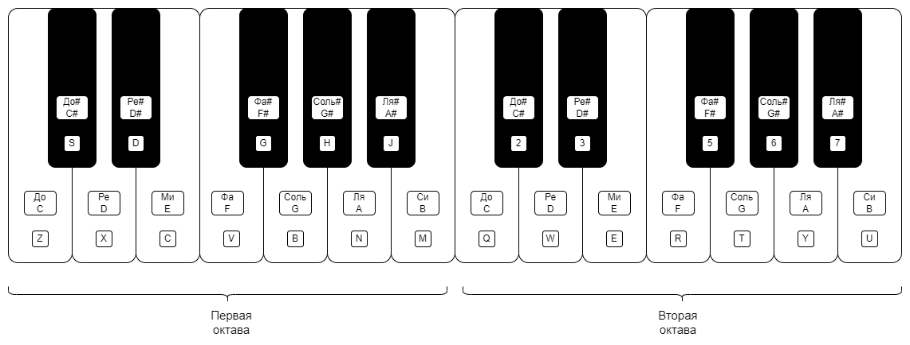
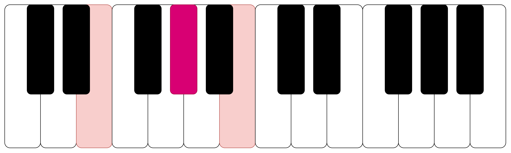
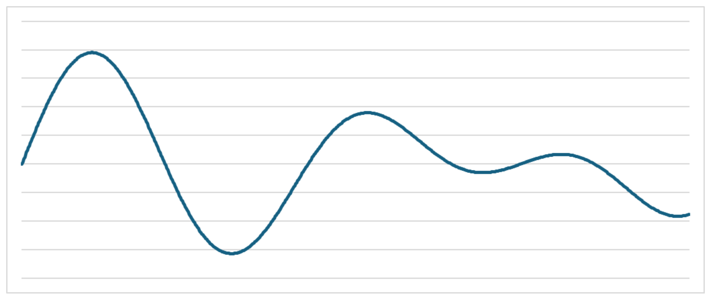
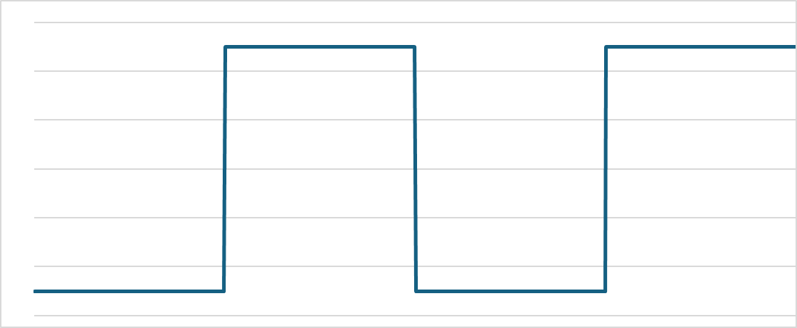
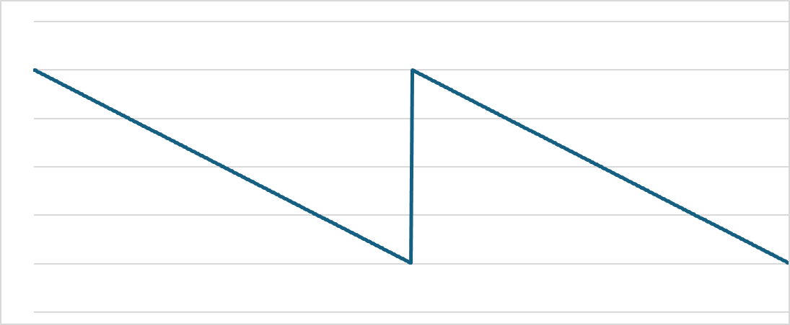
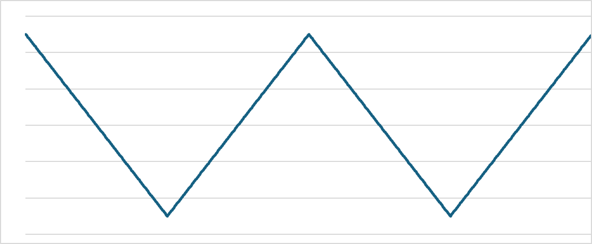
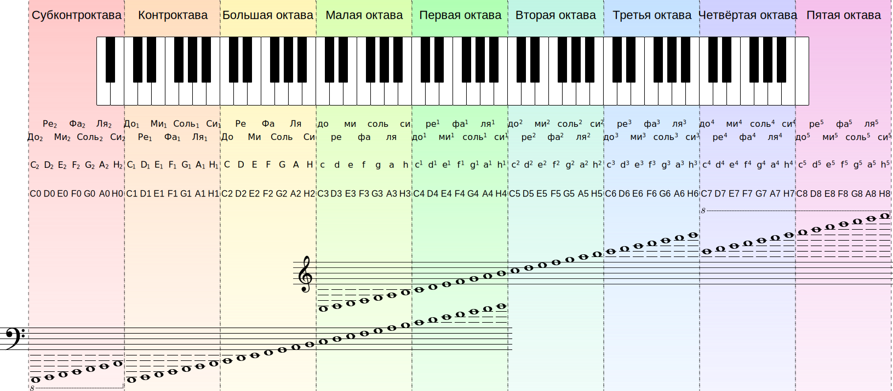
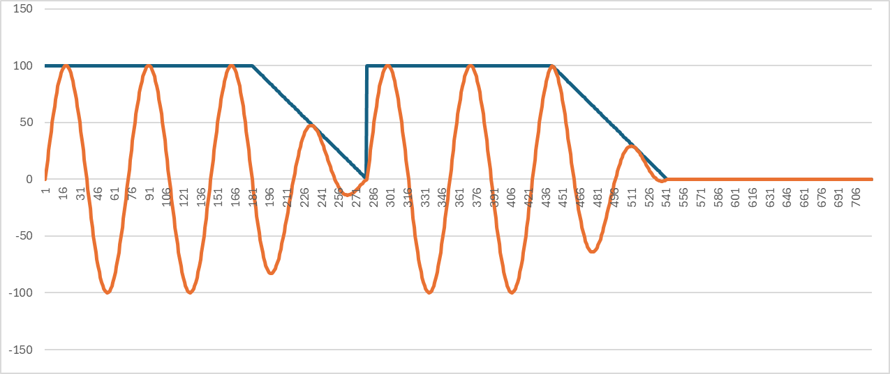
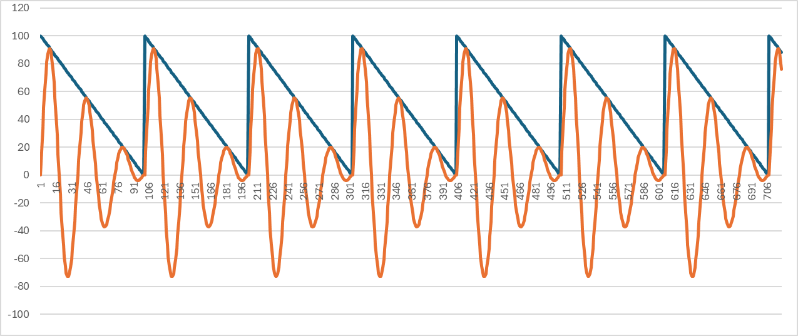
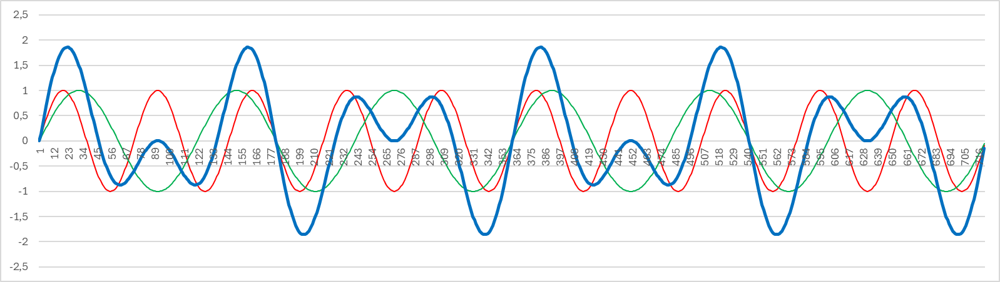

# Применение многопоточности в мультимедийных приложениях

- [Применение многопоточности в мультимедийных приложениях](#применение-многопоточности-в-мультимедийных-приложениях)
  - [Задания](#задания)
    - [Требования](#требования)
    - [Задание 1 — Генерирование звука](#задание-1--генерирование-звука)
      - [Вариант 1 — Виртуальное пианино — 100 баллов](#вариант-1--виртуальное-пианино--100-баллов)
        - [Бонус за визуализацию клавиатуры — 50 баллов](#бонус-за-визуализацию-клавиатуры--50-баллов)
        - [Бонус за визуализацию звуковой волны — 30 баллов](#бонус-за-визуализацию-звуковой-волны--30-баллов)
        - [Бонус за генерирование звуковых колебаний разной формы — 30 баллов](#бонус-за-генерирование-звуковых-колебаний-разной-формы--30-баллов)
      - [Вариант 2 — Музыкальный плеер — 150 баллов](#вариант-2--музыкальный-плеер--150-баллов)
        - [Бонус за возможность проигрывания многоголосных мелодий — 40 баллов](#бонус-за-возможность-проигрывания-многоголосных-мелодий--40-баллов)
        - [Бонус за визуализацию звуковой волны — 30 баллов](#бонус-за-визуализацию-звуковой-волны--30-баллов-1)
        - [Бонус за управление формой звуковых колебаний разной формы — 30 баллов](#бонус-за-управление-формой-звуковых-колебаний-разной-формы--30-баллов)

## Задания

- Для получения оценки "удовлетворительно" нужно набрать не менее 100 баллов.
- На оценку "хорошо" нужно набрать не менее 150 баллов.
- Для получения оценки "отлично" нужно набрать не менее 200 баллов.

### Требования

Обязательно проверяйте успешность всех вызовов функций операционной системы и используемых библиотек
и не игнорируйте ошибки.

Ваш код должен иметь уровень безопасности исключений не ниже базового.
Для этого разработайте (или возьмите готовую) RAII-обёртку, автоматизирующую
управление ресурсами операционной системы.

### Задание 1 — Генерирование звука

#### Вариант 1 — Виртуальное пианино — 100 баллов

Разработайте приложение, превращающее ваш компьютер в электронное пианино.

Программа должна издавать музыкальные звуки при нажатии клавиш клавиатуры.
Соответствие между клавишами и нотами показано на рисунке:



Частота ноты Ля 1 октавы (клавиша N) равна 440 Гц. Частота каждой последующей ноты
в $2^{1/12}$ раз выше, чем у предыдущей.
Частота i-й ноты вычисляется по формуле:

$$
\nu_i = 440 * 2^{i/12}
$$

Это так называемый "[Равномерно темперированный строй](https://ru.wikipedia.org/wiki/%D0%A0%D0%B0%D0%B2%D0%BD%D0%BE%D0%BC%D0%B5%D1%80%D0%BD%D0%BE_%D1%82%D0%B5%D0%BC%D0%BF%D0%B5%D1%80%D0%B8%D1%80%D0%BE%D0%B2%D0%B0%D0%BD%D0%BD%D1%8B%D0%B9_%D1%81%D1%82%D1%80%D0%BE%D0%B9)".

Нота Ля 2-й октавы на 12 полутонов выше ноты Ля 1-й, поэтому её частота равна: $440 * 2^{12/12} = 440 * 2^1 = 880$ Гц.
Поэтому ноты, взятые на октаву выше, звучат красиво (у них кратные частоты).

Нота Ми 1 октавы на 5 полутонов ниже ноты Ля 1-й октавы, поэтому её частота равна:
$440 * 2 ^ {-5/12} = 440 * 2 ^ {-0.416667} = 440 * 0.749153538 = 329.6275569$ Гц.

Звук должен воспроизводиться по следующим правилам:

- Звук должен воспроизводиться пока пользователь удерживает нажатой соответствующую клавишу.
  После отпускания клавиши звук должен затихнуть в течение 0.5 секунды.
- Одновременно могут звучать несколько звуков, если нажато несколько клавиш или пока звук отпущенной клавиши не затих.
- Если после отпускания клавиши нажать её повторно, пока её звук не затих, затухающий звук должен замениться новым.

##### Бонус за визуализацию клавиатуры — 50 баллов

Бонус начисляется за визуализацию клавиатуры пианино. Нажатые клавиши должны выделяться цветом.



Пользователь может нажимать музыкальные клавиши не только при помощи клавиатуры,
но и нажимая на них при помощи мыши.

##### Бонус за визуализацию звуковой волны — 30 баллов

Бонус начисляется за визуализацию звучащей звуковой волны.



##### Бонус за генерирование звуковых колебаний разной формы — 30 баллов

Бонус начисляется за возможность переключения между разными формами звуковых колебаний, кроме синусоидального сигнала.

Для переключения должны использоваться либо комбинации клавиш, либо графические элементы управления.

Волна в виде прямоугольных импульсов:



Пилообразный сигнал:



Ещё один пилообразный сигнал



#### Вариант 2 — Музыкальный плеер — 150 баллов

Разработайте приложение, позволяющее проигрывать музыкальные композиции.
Музыка записывается в виде текстового файла, в котором в каждой строке записываются проигрываемые в данный момент ноты.

Пример файла, в котором записано начало мелодии "В траве сидел кузнечик".

```txt
120
F4

C4

F4

C4

F4

E4
-
E4


-
E4

C4

E4

C4

E4

F4
-
F4


-
END
```

Строка `END` (как и конец файла) означает конец мелодии.

Число в самой первой строке задаёт темп композиции (количество строк, проигрываемых в минуту).
В каждой последующей строке задаётся 0 или больше нот. Каждая нота задаётся следующим регулярным выражением:

```re
[A-G][#]?[0-8]-
```

Символы `A`..`G` задают ноты от Ля до Соль. Символ `#` обозначает "диез" (♯), повышающий базовую ноту на полтона.
В этом плане есть некоторое расхождение с официальной нотной записью, в которой нота Си обозначается символом H, а не B.
С его помощью обозначаются ноты, соответствующие чёрным клавишам клавиатуры.
Диез может следовать за нотами `A` (ля), `C` (до), `D` (ре), `F` (фа), `G` (соль).

Символ "Бемоль" (♭), понижающий базовую ноту на полтона, не используется.
Вместо него используется "диез", повышающий предыдущую ноту, например, вместо "Си бемоль" используется "Ля диез".

Цифра, следующая за нотой, задаёт номер октавы от 0 (субконтроктава) до 8 (пятая октава):



Символ минус ("-") используется, чтобы обозначить момент "отпускания" ноты.
В этот момент звук ранее играющей ноты начинает затухать.
Время затухания амплитуды звука равно длительности проигрывания строки.
Это полезно, чтобы звуки не сливались сливались, когда подряд играют две ноты.

```txt
A4
-
A4
-
```

Амплитуда и соответствующая ей синусоидальная волна показана на рисунке:



Если после ноты указан символ минус ("-") она начинает проигрываться
с полной амплитудой и затухает в течение времени проигрывания текущей строки.
Это также позволяет проигрывать последовательно две одинаковые ноты,
чтобы их звуки не сливались:

```txt
A4-
A4-
A4-
```



##### Бонус за возможность проигрывания многоголосных мелодий — 40 баллов

Добавить возможность проигрывать многоканальную музыку. Каналы разделяются символом `|`.
Звук в каждом канале проигрывается независимо от других.

Максимальное количество каналов в программе должно быть ограничено некоторой константой, например, 10.
Пробелы не влияют на проигрывание нот и служат для форматирования для удобного чтения.

Эта последовательность команд последовательно проигрывает четыре аккорда: До мажор, Фа мажор, Соль мажор, До мажор.

```txt
60
C4 |E4 |G4
-  |-  |-  
F3 |A3 |C4
-  |-  |-
G3 |B3 |B4
-  |-  |-
C4 |E4 |G4
-  |-  |- 
END
```

Чтобы смешать несколько звуков в один, нужно сложить их сэмплы генераторов звуковых колебаний.
На  рисунке показан результат смешивания звуков двух частот: $\omega$ (зеленый график) и $3\omega$ (красный график)
и их сумма (синий график).



##### Бонус за визуализацию звуковой волны — 30 баллов

Бонус начисляется за визуализацию звучащей звуковой волны.


##### Бонус за управление формой звуковых колебаний разной формы — 30 баллов

Бонус начисляется за возможность управления формой звуковых колебаний, кроме синусоидального сигнала.

Форма сигнала указывается через после ноты.
Если форма не указана, сигнал считается синусоидальным.

Волна в виде прямоугольных импульсов:

`P` — прямоугольные импульсы (pulse). Пример:

```txt
A4P
```


Пилообразный сигнал:

`\` — пилообразный сигнал. Пример:

```txt
A4\
```


Ещё один пилообразный сигнал

`W` — пилообразный сигнал. Пример:

```txt
A4W
```


Команда `-` (затухание звука) в этом случае указывается в самом конце:

```txt
A4P-
```
