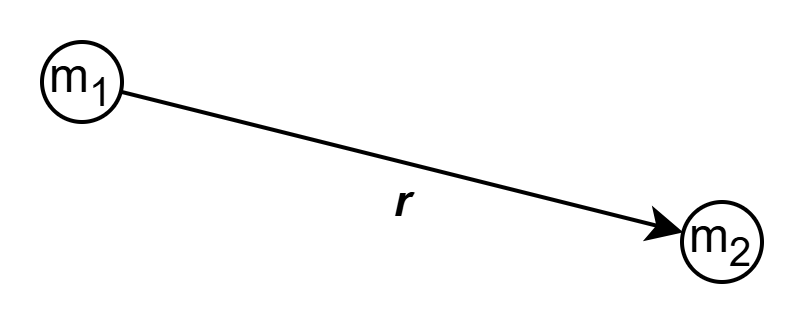
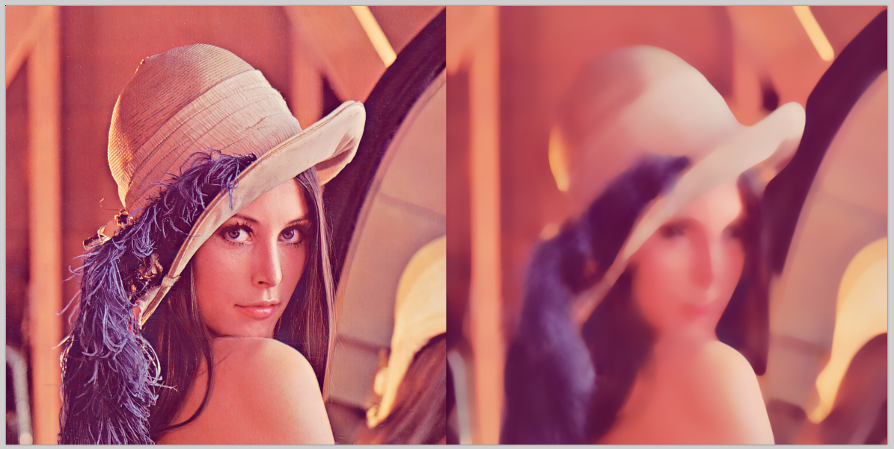
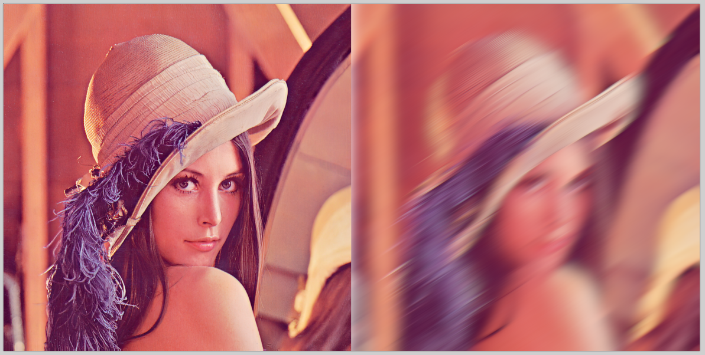

# Параллельные вычисления на видеокартах

- [Параллельные вычисления на видеокартах](#параллельные-вычисления-на-видеокартах)
  - [Задания](#задания)
    - [Требования](#требования)
    - [Задание 1 — Симуляция гравитационного взаимодействия системы частиц — 100 баллов](#задание-1--симуляция-гравитационного-взаимодействия-системы-частиц--100-баллов)
    - [Задание 2 — Параллельная сортировка данных на GPU — 50 баллов](#задание-2--параллельная-сортировка-данных-на-gpu--50-баллов)
    - [Задание 3 — Параллельная обработка изображений на GPU](#задание-3--параллельная-обработка-изображений-на-gpu)
      - [Вариант 1 — Gaussian Blur — 60 баллов](#вариант-1--gaussian-blur--60-баллов)
      - [Вариант 2 — Median Blur — 60 баллов](#вариант-2--median-blur--60-баллов)
      - [Вариант 3 — Radial Blur — 50 баллов](#вариант-3--radial-blur--50-баллов)
      - [Вариант 4 - Motion Blur — 50 баллов](#вариант-4---motion-blur--50-баллов)
      - [Вариант 5 - Ваш вариант фильтра — баллы в зависимости от сложности фильтра](#вариант-5---ваш-вариант-фильтра--баллы-в-зависимости-от-сложности-фильтра)

## Задания

- Для получения оценки "удовлетворительно" нужно набрать не менее X баллов.
- На оценку "хорошо" нужно набрать не менее Y баллов.
- Для получения оценки "отлично" нужно набрать не менее Z баллов.

### Требования

Обязательно проверяйте успешность всех вызовов функций операционной системы и используемых библиотек
и не игнорируйте ошибки.

Ваш код должен иметь уровень безопасности исключений не ниже базового.
Для этого разработайте (или возьмите готовую) RAII-обёртку, автоматизирующую
управление ресурсами операционной системы.

### Задание 1 — Симуляция гравитационного взаимодействия системы частиц — 100 баллов

Разработайте программу, выполняющую симуляцию гравитационного взаимодействия
системы из N частиц.
Количество частиц составляет десятки тысяч штук.
Для ускорения вычислений перенесите расчёт физики на видеокарту с помощью OpenCL.

На каждую частицу системы действует сила гравитации со стороны остальных частиц в соответствии с законом всемирного тяготения:

Сила, действующая на тело массой $m_1$ со стороны тела массой $m_2$,
находящемся на расстоянии вектора $\vec{r}$, равна.

$$\vec{F}(\vec{r})=G\frac{m_1m_2}{r^3}\vec{r}$$

Суперпозиция (то есть сумма) сил, действующих на тело, придаёт им ускорение.

Визуализируйте симуляцию системы частиц при помощи OpenGL или иного графического API, поддерживающего аппаратное ускорение.

При помощи мыши и клавиатуры пользователь должен иметь возможность управлять
камерой и другими параметрами симуляции:

- Скорость течения времени
- Гравитационная постоянная
- Добавление и удаление точек

### Задание 2 — Параллельная сортировка данных на GPU — 50 баллов

Напишите программу, выполняющую сортировку массива 32-битных целых чисел на GPU.
Для этого используйте алгоритм [битонной сортировки](https://ru.wikipedia.org/wiki/%D0%91%D0%B8%D1%82%D0%BE%D0%BD%D0%BD%D0%B0%D1%8F_%D1%81%D0%BE%D1%80%D1%82%D0%B8%D1%80%D0%BE%D0%B2%D0%BA%D0%B0).

Сравните время сортировки на GPU с временем сортировки на CPU с помощью параллельной версии алгоритма `std::sort`.

### Задание 3 — Параллельная обработка изображений на GPU

Напишите программу применяющую к изображению один из фильтров.
Наложение фильтра должно выполняться на GPU.
Приложение должно позволять изменять параметры фильтра при помощи ползунка (ползунков).

Можно сделать несколько вариантов.

#### Вариант 1 — Gaussian Blur — 60 баллов

#### Вариант 2 — Median Blur — 60 баллов

#### Вариант 3 — Radial Blur — 50 баллов

#### Вариант 4 - Motion Blur — 50 баллов

#### Вариант 5 - Ваш вариант фильтра — баллы в зависимости от сложности фильтра
